# PhotoLaboratory by tonitaga

---
<p align="center">

</p>

## Contents
0. [Install](#install)
1. [Main Information](#main-information)
2. [What it looks like?](#what-it-looks-like)\
    2.1. [Main Window](#main-welcome-window)\
    2.2. [Edit Window](#edit-window)\
    2.3. [Custom Kernel Window](#custom-kernel-window)
3. [Application's Menu](#applications-menu)
4. [HotKeys and ToolTips](#hotkeys-and-tooltips)

---

## Install

To install the PhotoLaboratory-Application-CPP-Qt, follow these steps:

1. Clone or download repository.

```shell
git clone https://github.com/tonitaga/PhotoLaboratory-Application-CPP-Qt.git
```

2. Ensure you have the g++ compiler installed on your system.
3. Install dependencies

```shell
make install
```

4. Run the program

```shell
make run
```

or download release archive .zip by url

```shell
https://github.com/tonitaga/PhotoLaboratory-Application-CPP-Qt/releases/tag/PhotoLaboratory
```

## Main information:

The application is developed in the C++ programming language and allows the user to apply various filters to his image.\
The application supports images in the png bmp jpg jpeg format.\
You can find 12 different filters in the application:

---
1) <b>Convolution filters</b>: Emboss, Sharpen, BoxBlur, GaussianBlur, Laplacian, Prewitt, Custom
2) <b>Non Convolution filters</b>: GrayScale, Negative, Toning
3) <b>Color-correction filters</b>: Contrast, Brightness, HSV color model, HSL color model
---

## What it looks like?

#### Main (Welcome) window
<p align="center">
    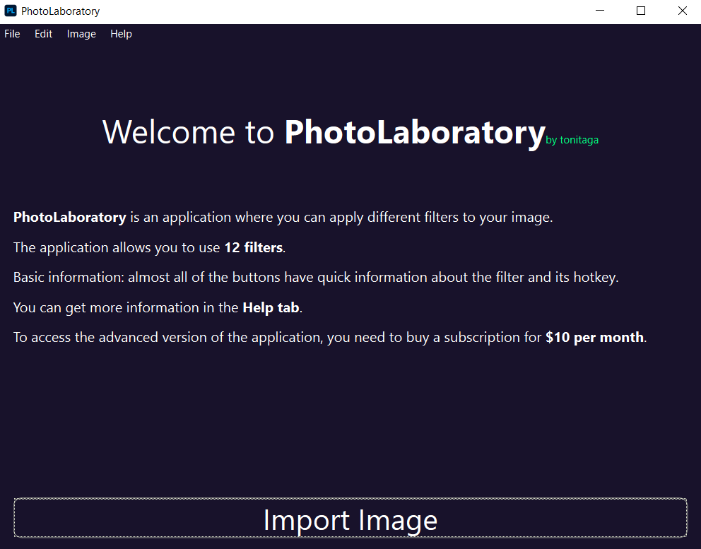
</p>

#### Edit window
<p align="center">
  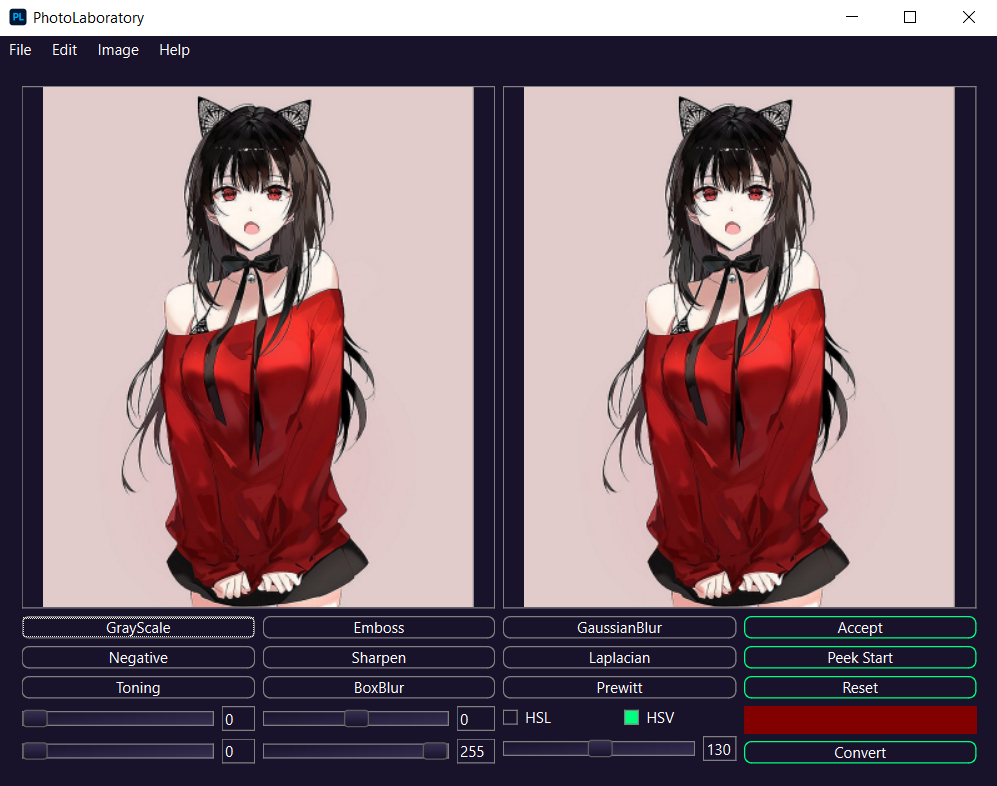
</p>

#### Custom Kernel window
<p align="center">
    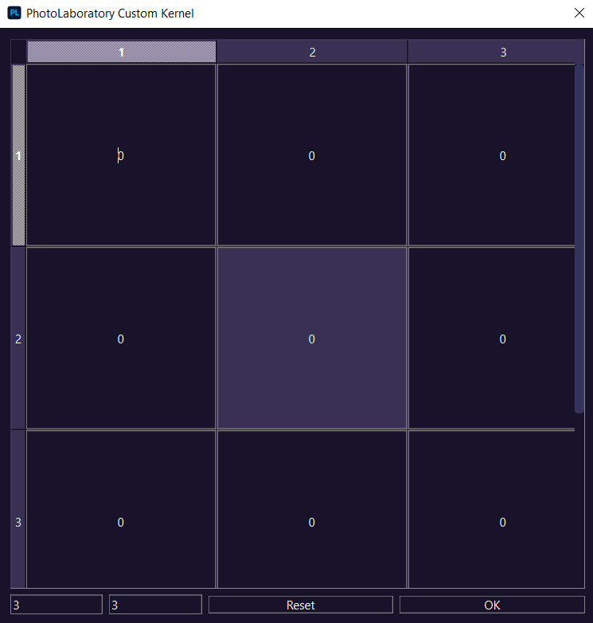
</p>

---

## Application's Menu

The application has a menu with additional options.\
The menu is divided into four parts:
1) File menu (allows you to import and export images).
2) Edit menu (with this menu you can also use some filters, added possibility to adjust window transparency).
3) Image menu (allows you to choose one of three types of image display).
4) Help menu (let you navigate between windows and learn more about the application).

<p align="center">
    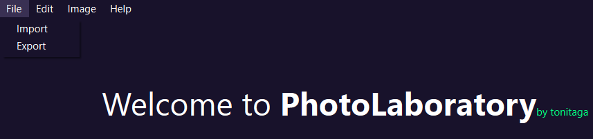
    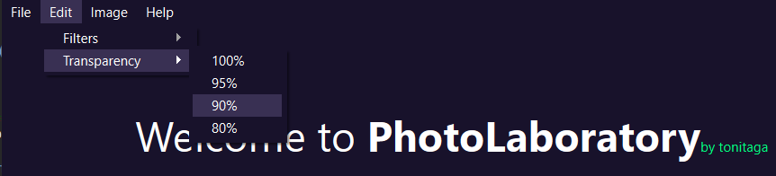
    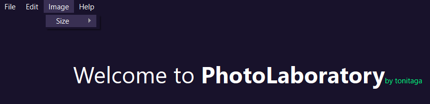
    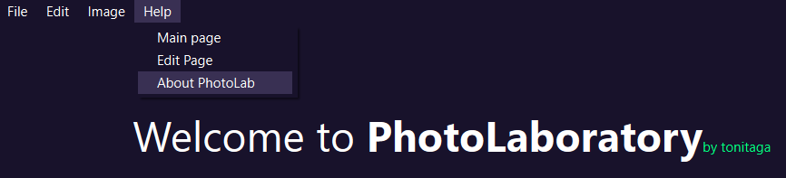
    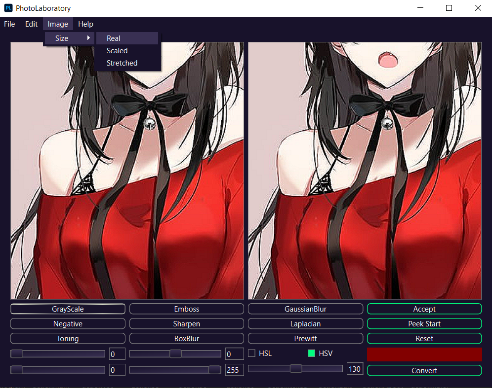
    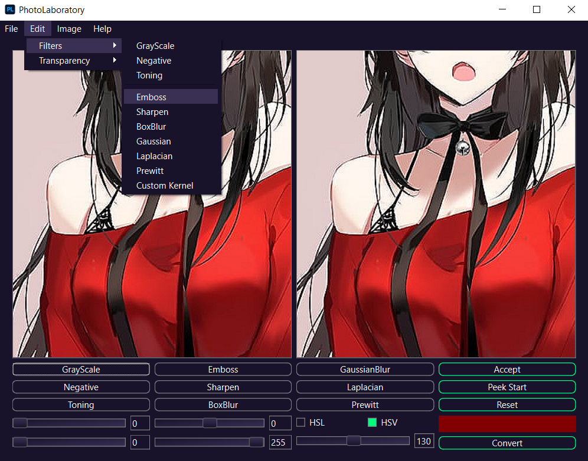
</p>

---

## HotKeys and ToolTips

Most of the buttons have hotkeys, short information about what this button does can be seen by putting the mouse cursor over it.\
Almost all that is in the application have their own short information, you just need to move the mouse.

<p align="center">
    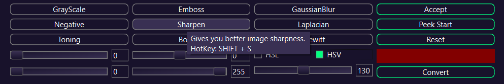
    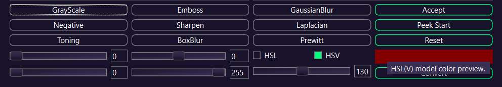
    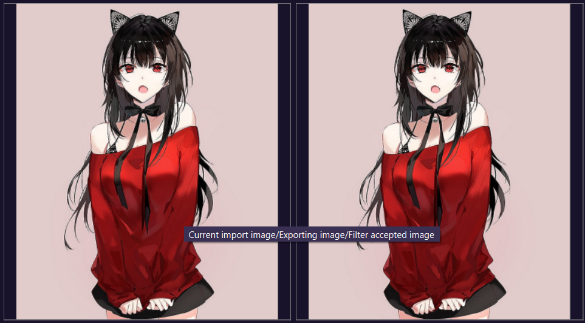
</p>

---

#### © tonitaga (Нурислам Губайдуллин) 19.10.2023
